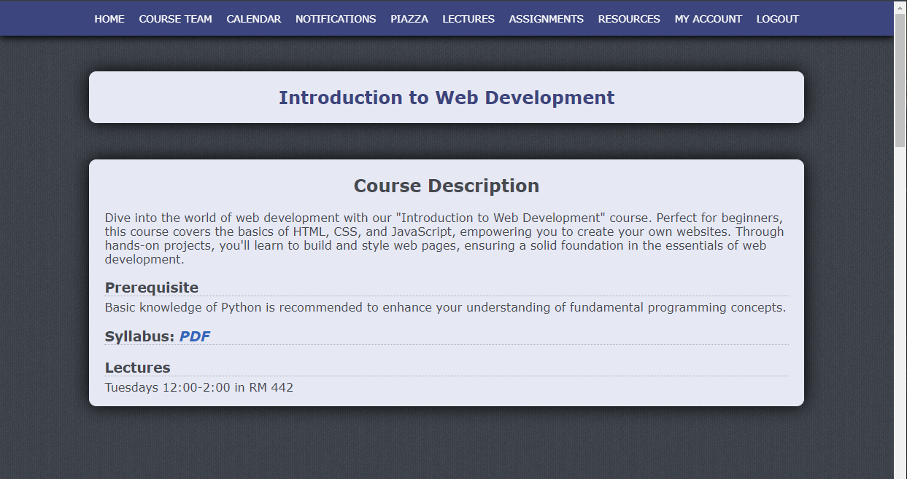
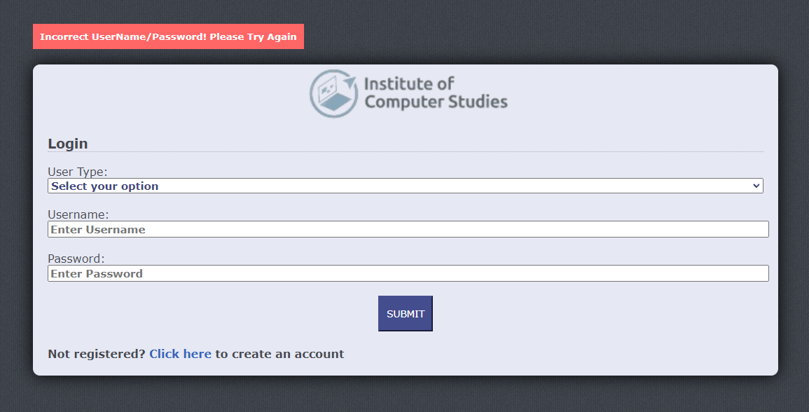

# Description
A responsive course website created using the web framework [Flask](https://flask.palletsprojects.com/en/3.0.x/) and [Jinja2](https://jinja.palletsprojects.com/en/3.1.x/). [DB4S](https://sqlitebrowser.org/) along with the extension [Flask-SQLAlchemy](https://flask-sqlalchemy.palletsprojects.com/en/3.1.x/) was used to create, edit and manage the database file for this site.

**Disclaimer:** The content on this website such as the institute name, course description, instructors, assignments, etc. is for fictional and illustrative purposes only. All images used were found in the public domain and are credited at the bottom of the homepage.

# Usage
* Run the app.py script through your command line or terminal by entering `python app.py` and head over to the URL provided.
* A cloud version is also available at [shuvarthyd.pythonanywhere.com](https://shuvarthyd.pythonanywhere.com/). (For the cloud version the session is cleared upon clicking the link)

# Funtionality
Users can view basic course content such as syllabus, resources, etc. They can also choose to **login** or **register** (from the "Login" button in the navigation bar) as a **student** or **instructor** to access additional features. There are 2 default students and instructors that users can use, as seen in the table below:

| Name          | User Type     | Username  | Password |
| ------------- |:-------------:| ---------:| --------:|
| Mike Scott    | Student       | student1    | student1    |
| Tyler Reed    | Student       | student2    | student2    | 
| Sue Allen     | Instructor    | instructor1 | instructor1 |
| John Smith    | Instructor    | instructor2 | instructor2 |

## Student Features
   - Access their account page (from the "My Account" button in the navigation bar) to view basic user information along with their grades. Note that default grades were set for    
     the 2 students seen in the table above.
   - Submit a remark request for any of their grades. A default remark request was set for the student Tyler Reed.
   - Submit a feedback report for their instructors (from the "Feedback" button in the navigation bar)

## Instructor Features
   - Access their account page (from the "My Account" button in the navigation bar) to view basic user information along with the student's remark requests and feedback. Note that 
     a default feedback report was provided for the instructor Sue Allen.
   - Edit the marks of the students.

# Additional Features
* Responsive Design
   1250x650px                 |  390x844px
   :-------------------------:|:-------------------------:
     |  

* Error Handling

